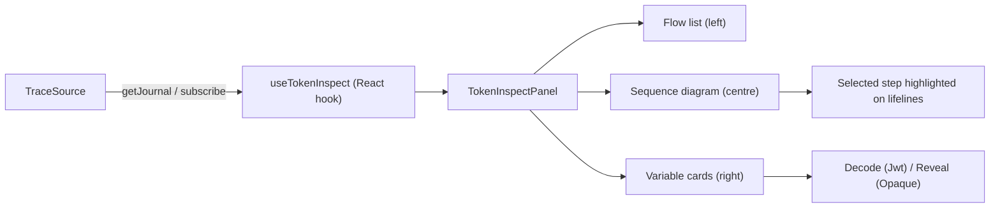

# Architecture

Token Inspect is built around one idea: capture the trace at the point where the token is observable. That point depends on your architecture, so the plugin offers three adapters. All three emit the same schema and feed the same panel.

## The principle: meet the token where it lives

If you ask "where does the token live in my system?" the answer dictates where the trace can be captured:

| Token lives in | Capture happens in | Adapter |
|---|---|---|
| Browser storage or memory | The browser | `ClientObserver` (`@oidc-token-inspect/browser`) |
| Server memory or session store | The server | `ServerMiddleware` (`TokenInspect.AspNetCore`) |
| Anywhere the host calls `Record(...)` | Wherever the host puts the call | `ExplicitRecorder` (`TokenInspect`) |

You do not pick an "implementation". You pick the adapter that matches your architecture, and the panel renders whichever traces arrive.

## Three adapters, one schema

### ClientObserver (browser)

Wraps `window.fetch` and `XMLHttpRequest` with pass-through proxies, observes `localStorage`/`sessionStorage` writes, and reads OAuth/OIDC redirect parameters from `window.location`. From these signals it reconstructs flows: `auth.login` (Authorization Code + PKCE), `auth.implicit`, `auth.ropc`, `auth.refresh`, `api.call`.

Pass-through means the host call always runs first, untouched, and the instrumentation runs in a `try`/`catch` that swallows on error. The plugin can never break a request.

The observer is opt-in. Default config leaves `window.fetch` exactly as it was.

### ServerMiddleware (ASP.NET)

A drop-in middleware (`app.UseTokenInspect()`) records the token your API receives, the validation result, the RBAC decision, and any downstream `HttpClient` call. Buffered in a bounded in-memory ring with TTL. A dev endpoint (`MapTokenInspectDev()`) exposes the buffer to the browser, gated by an `Authorize` delegate the host provides.

The principal is resolved from `HttpContext.User`. The endpoint never derives identity from a request header.

### ExplicitRecorder (host-controlled)

For architectures where the host wants full control (a BFF, a SessionManager, a server with its own session model), the host injects an `IFlowRecorder` and calls `Record(...)` at meaningful points. The host also provides an `ITraceStore` (in-memory, Redis, etc.) and a `MapTokenInspect()` egress endpoint with an `Authorize` delegate.

This is the highest-fidelity path and the lowest-magic path. The host knows exactly what is recorded.

## The trace schema

Every adapter emits the same shapes. Mirrored between TypeScript and C#.

```ts
interface FlowRun {
  id: string;
  flowKind: string;                // "auth.login" | "auth.refresh" | "token.exchange" | "api.call" | ...
  title: string;
  status: "Running" | "Completed" | "Failed";
  startedAt: string;
  endedAt?: string | null;
  participants: string[];          // lanes in the sequence diagram
  steps: TraceStep[];
  correlationId?: string;          // joins client and server runs
  source?: "client" | "server" | "bff" | "merged";
}

interface TraceStep {
  ordinal: number;
  label: string;
  short?: string | null;           // optional short label for the lane diagram
  from: string;
  to: string;
  timestamp: string;
  vars: TraceVariable[];
  note?: string | null;
  source?: "client" | "server" | "bff";
  seq?: number;                    // logical order within a source
}

interface TraceVariable {
  name: string;                    // "code_verifier", "access_token", "state", ...
  kind: "Jwt" | "Opaque" | "Code" | "Url" | "Hash" | "Plain" | "Json";
  value: string;
  redacted?: boolean;
}

interface TraceJournal {
  sessionId?: string;
  runs: FlowRun[];
}
```

`flowKind` is an open string. Adapters use `auth.login`, `auth.refresh`, `token.exchange`, `api.call` by default; you are free to introduce your own.

`kind` on a variable tells the panel how to render the value: decode a JWT, reveal an opaque token, treat as a URL, and so on.

## TraceSource: the panel's input contract

The panel does not care where the runs came from. It reads from a `TraceSource`:

```ts
interface TraceSource {
  getJournal(): TraceJournal | Promise<TraceJournal>;
  subscribe(cb: (j: TraceJournal) => void): () => void;
}
```

Three implementations ship in `@oidc-token-inspect/core`:

| Implementation | Use when |
|---|---|
| `HttpTraceSource(client, endpoint)` | Server-recorded traces fetched over HTTP (BFF or API middleware) |
| `LiveTraceSource` | Browser-observed traces written by `ClientObserver` |
| `CompositeTraceSource(sources[])` | Both at once, merged by `correlationId` |

`init()` in `@oidc-token-inspect/browser` constructs the right source from your config: `egress.endpoint` only ⇒ HTTP; `capabilities.clientObserver: true` only ⇒ live; both ⇒ composite.

## Merge by correlation id (the hybrid case)

When a request originates in the browser, hits an instrumented server, and the server has the middleware, both lanes describe the same logical operation. They are merged into one `FlowRun` by `correlationId`:

```
browser observed:  auth.login --[traceparent: 00-abc123…]--> POST /api/orders
server observed:                                              POST /api/orders [token validated, RBAC: ALLOW]
```

The plugin sends a W3C `traceparent` header on outgoing API calls (same-origin allowlist only) so the server middleware can attribute its run to the same id. Steps from both lanes are interleaved by logical sequence per source, not by wall clock, to avoid clock-skew noise.

## How the panel renders



The panel is a normal React component (`@oidc-token-inspect/react`). The browser drop-in (`@oidc-token-inspect/browser`) mounts it inside a closed Shadow DOM with the panel's own stylesheet inlined, so it is isolated from the host page.

## Anonymous to authenticated lane bridge

A journey that starts before login is split across an IdP redirect: an anonymous run on the landing page, a gap while the IdP authenticates the user, and an authenticated run after the callback. The bridge joins these into one `FlowRun` so the panel renders the pre-login and post-login lanes as a single story.

The `anonymousRunId` carries the join across the gap:

1. **Created in the SPA.** With `anonymousRunId: 'auto'`, `init()` generates a UUID v4 (or reads the existing one) on first visit.
2. **Persisted via storage.** The id lives in same-origin `localStorage`, alongside the persisted journal (`persist: true`), so it survives reloads.
3. **Sent through `state`.** `getLoginUrl(baseUrl)` appends `tii_anon=<id>` to the login URL; the host round-trips it through the OAuth `state` parameter on the authorize request.
4. **Adopted on `/callback`.** After the code exchange, the host calls `IFlowRecorder.AdoptAnonymousRun(anonymousRunId, sessionId)`, which re-keys the in-flight run under the authenticated session id via `ITraceStore.RekeyRunAsync`. Steps recorded after adoption persist under the session id, so the journal the SPA fetches after login carries the pre-login steps too.

```
  anonymous SPA            IdP redirect (gap)        callback              authenticated SPA
  ------------             ------------------        --------              -----------------
  init({ anonymousRunId })                                                 journal restored from
  run started, id stored      state=...&tii_anon=ID                        localStorage, same id
        |                            |                     |                        |
        |  getLoginUrl() ----------> |                     |                        |
        |   (id in state)            |   (IdP: not         |                        |
        |                            |    instrumented)    |                        |
        |                            | -- code + state -->  AdoptAnonymousRun(      |
        |                            |                       ID, sessionId)          |
        |                            |                          |                    |
        |                            |                     re-key run ID -> sessionId|
        |                            |                          |                    |
        x============================ one continuous FlowRun ====================>   |
```

The IdP sits in the gap and is never instrumented; the bridge reconnects the lanes on either side of it without observing what happened inside it. See [journey-continuity.md](journey-continuity.md) for the configuration and the callback handler.

## What does not exist by design

- No replay. The panel cannot re-run a request.
- No mutation. The panel cannot change a token, a header, or a response.
- No outgoing traffic from the plugin. The egress endpoint is host-defined and frozen at init; the plugin never transmits values off-origin.
- No cross-origin correlation. The `traceparent` header is injected only on the configured allowlist.

These are not limitations; they are the security contract.
